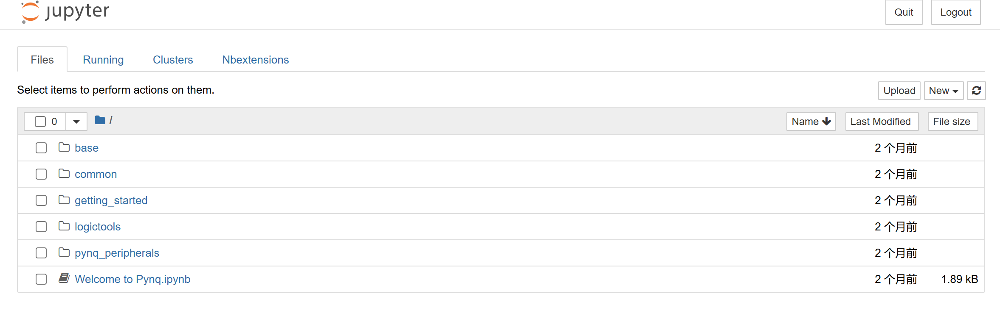
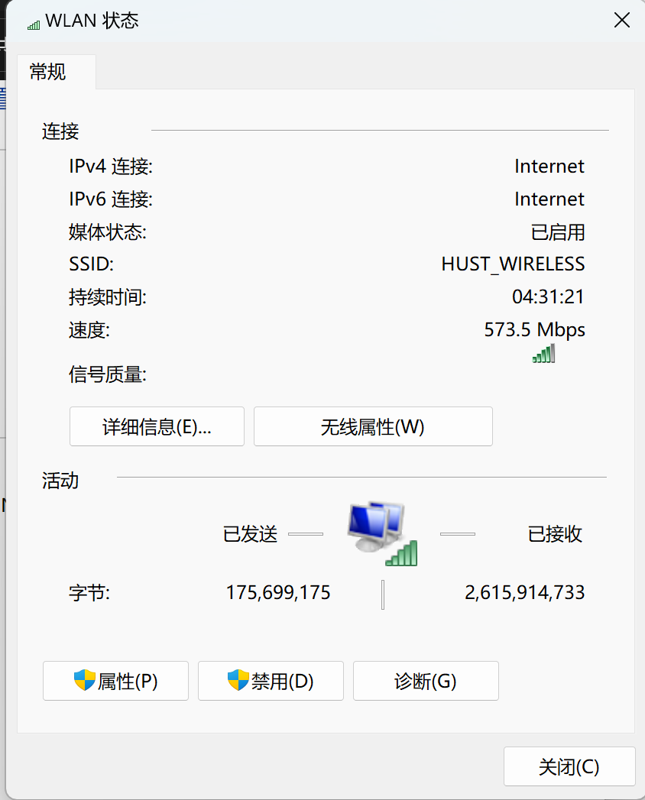
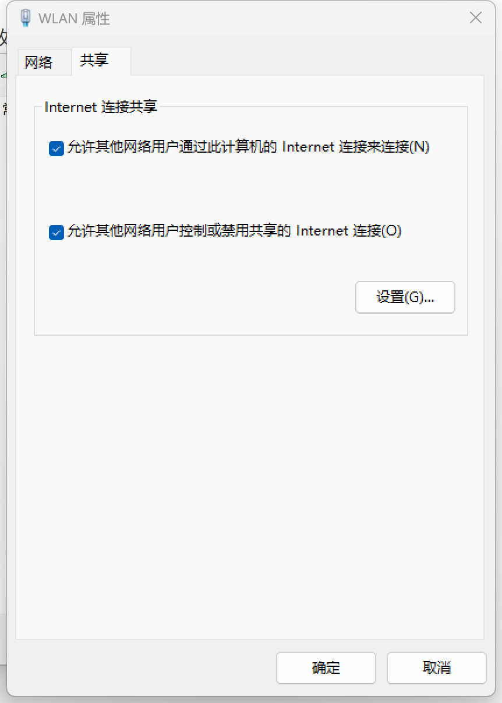

## PYNQ-Z2开发板使用

* 首先，用micro USB（**若直接连接电脑，可能会由于主板驱动能力不足而无法正常启动**）或DC电源适配器（7-15V，推荐12V）给开发板供电

* 用网线将开发板和电脑连接起来

* 配置好网络连接（请跳转到**网络配置**一节）

* 打开电路板电源开关，**静待一分钟后**，指示灯闪烁，随后有**除供电指示灯以外的灯常亮**即代表启动完成

* 打开浏览器，跳转到**192.168.137.158**，输入初始密码xilinx，看到如下界面 

  

## 网络配置

* 控制面板->网络和Internet->网络与共享中心

  

* 选择你连接的网络（如此处选择HUST-WIRELESS），进入WLAN状态窗口

  

* 选择属性，点击共享，勾选选项即可

  

