# PYNQ-Z2 Audio Analyzer🎵💡

> **全国大学生嵌入式芯片与系统设计竞赛-FPGA创新设计赛道（AMD）的命题式基础赛道决赛作品仓库（全国二等奖）**
>
> Repository of the final project for the themed basic track of the National Undergraduate Embedded Chip and System Design Competition: FPGA Innovation Design Track (AMD)


## 📃 Overview

### 🎵 Project Title

**Full-Stack High-Performance Real-Time Audio Processing System Based on AMD PYNQ-Z2**

*基于 AMD PYNQ-Z2 的**全栈式高性能实时音频处理系统***

------

### 📖 Project Introduction

This project develops an independent, **hardware-software co-designed** high-performance audio processing system leveraging the **AMD PYNQ-Z2** platform. By utilizing **Vitis HLS**, the system implements highly parallel **FFT** and **FIR filter** IP cores, harnessing FPGA hardware acceleration to achieve significant gains in computation speed and throughput.

*本项目利用 **AMD PYNQ-Z2** 平台，构建了一套独立运行、**软硬协同**的高性能音频处理系统。系统通过 **Vitis HLS** 开发了高并行度的 **FFT（快速傅里叶变换）**与 **FIR 滤波器** IP 核，利用 FPGA 硬件加速显著提升了运算速率与吞吐量。*

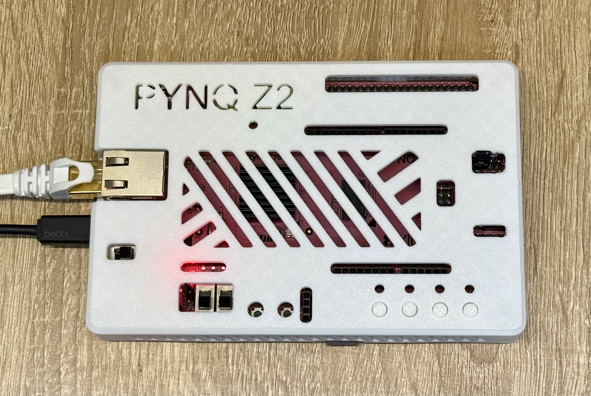

------

### ✨ Features

- 🚀 **Hardware Acceleration**: Implements 4096-point FFT and Spectral Subtraction algorithms entirely on the Artix-7 PL (Programmable Logic). This offloads intensive computation from the ARM processor, ensuring low latency.
- ⚡ **Real-Time Processing**: Adopts a Stream-based Dataflow architecture with **SSR=2** (Super Sample Rate), capable of processing 2 samples per clock cycle for high-throughput audio streams.
- 📊 **Live Visualization**: Provides high-frame-rate spectrum analysis via a PyQt5-based Upper Host application or Web UI, supporting both professional analysis and immersive visualization modes.
- 🛠️ **Hybrid Design**: Demonstrates a robust Hardware-Software Co-design, seamlessly integrating Vitis DSP Library L1 IP cores with custom HLS logic and Python drivers.

------

### 📌 System Architecture

The system adopts a heterogeneous **PS + PL** architecture, leveraging the Zynq-7000 SoC's strengths.

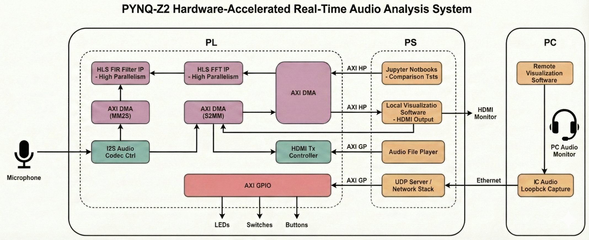

------

### 🖥️ Upper Host Functions

The Upper Host application (developed in Python/PyQt5) serves as the control center and visualization frontend for the system.

1.  **Real-time Spectrum Analyzer (Pro Mode)**:
    *   **Dual-View Visualization**: Features a **Waveform Plot** for instantaneous amplitude and a **Waterfall Plot** for historical frequency tracking.
    *   **Analysis Tools**: Includes **Peak Detection**, cursor measurement, and adjustable frequency ranges for detailed signal inspection.
    *   **Visualizes** the spectrum in real-time using data streamed via UDP from the PYNQ board.

    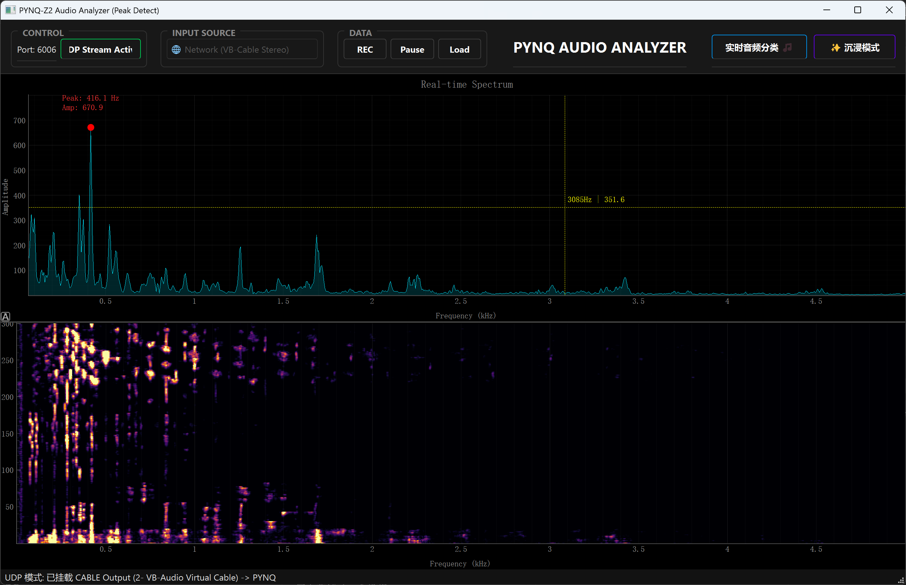

2.  **Immersive Visualizer (Immersion Mode)**:
    *   **Dynamic Visuals**: An aesthetic visualization mode designed for music playback.
    *   **Reactive Elements**: Graphical elements react to audio rhythm and intensity, providing an engaging visual experience.

    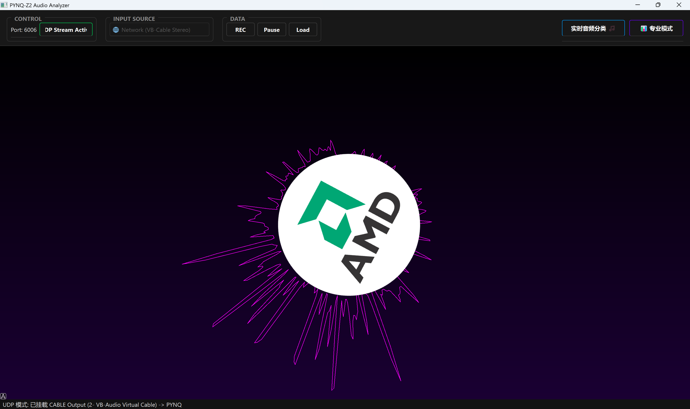

3.  **Smart Audio Analysis**:
    *   **Real-time Classification**: Automatically classifies audio scenes based on energy distribution across Bass, Mid, and High frequency bands.
    *   **Intelligent Feedback**: Detects dominant frequency characteristics (e.g., High-frequency dominance vs. Low-frequency beats).

    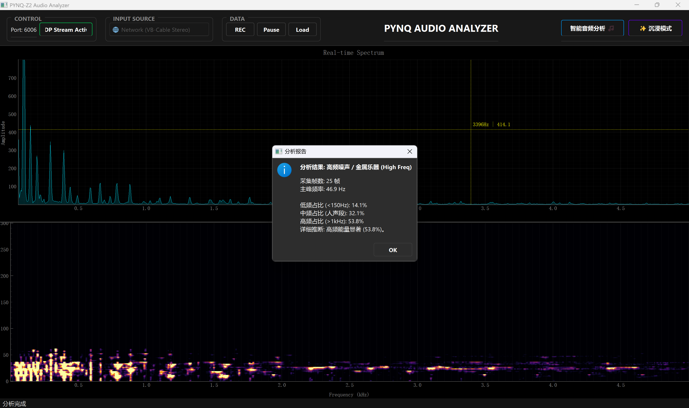

    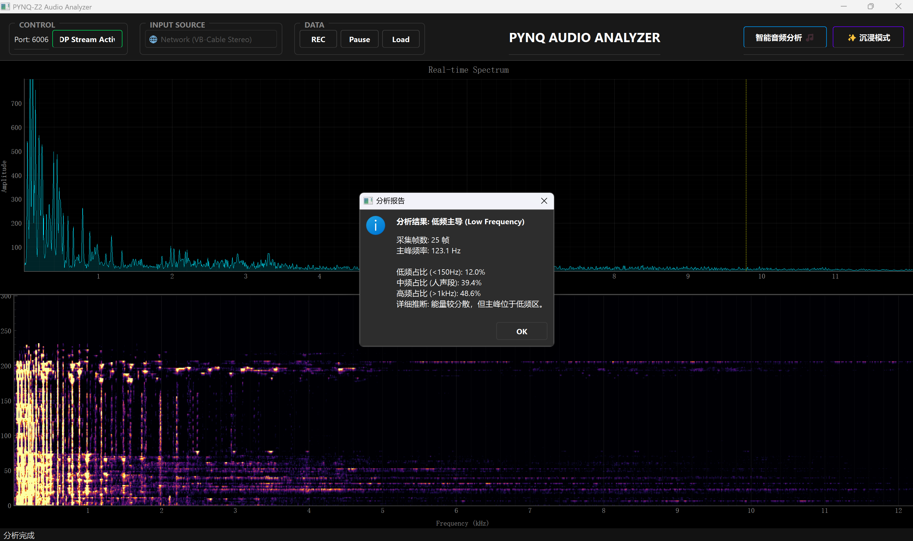

4.  **Data Recording & Input Audio Selection**:

    *   **Record**: Supports recording real-time spectrum data to local storage for offline analysis.
    *   **Playback**: Allows replaying recorded sessions to simulate live input.

    *   **Flexible Source**: Supports receiving audio data via **UDP Network Stream** from the PYNQ board or capturing from a **Local Audio Device** (e.g., microphone, virtual cable).

    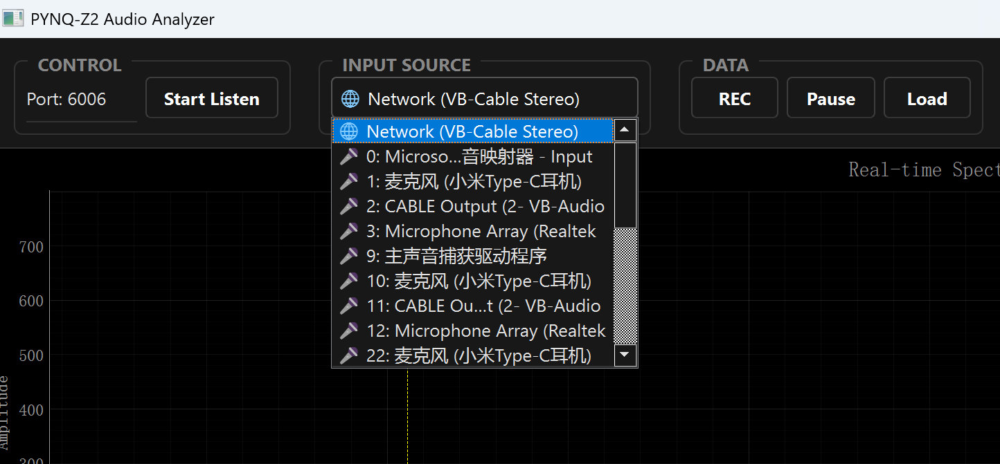

## 📂 Structure

```
.
├── doc/                        # Documentation and tutorials
├── notebook/                   # Main deployment folder (Bitstream, Notebooks)
├── src/                        # Source code and Vivado projects
│   ├── basic/                  # Audio codec control IP and basic tests
│   ├── overlay/                # Vivado build scripts
│   ├── pynq_z2_denoise/        # Denoise HLS implementation (Source Code)
│   └── pynq_z2_fft_port/       # FFT HLS implementation (Source Code)
├── Upper PC Host/              # PC Host application (Python Visualization)
└── README.md
```

## 💻 Software Requirements

* Vitis HLS (2024.2)
* Vivado (2024.2)
* v3.0.1 PYNQ image (On PYNQ-Z2)
* Python 3.x, PyQt5, pyqtgraph, sounddevice, numpy (On Upper PC Host)
* Virtual Cable (Optional, for local audio loopback)
* Putty (For SSH access)

## 🛠️ Hardware Requirements

* PYNQ-Z2 — **1 pc**
* Micro SD Card — **1 pc**
* Micro USB Cable — **1 pc**
* Ethernet Cable — **1 pc**
* Audio Source (Phone/PC) & Headphones/Speakers

## 🚀 Getting Started

### Step 1: PYNQ Board Setup

1.  **Image Setup**: Burn the PYNQ v3.0.1 image to the Micro SD card.
2.  **Connections**: Connect the PYNQ-Z2 board to the PC via Ethernet and Micro USB.
3.  **Network**: Configure the network settings to access the Jupyter Notebook server (usually `192.168.2.99`).
4.  **Deployment**: Upload the `notebook` folder contents to the PYNQ board's Jupyter workspace.
5.  **Run Backend**: Open `notebook/main.ipynb` (or the relevant notebook for your experiment) in the Jupyter interface and run the cells to load the Overlay and start the UDP data stream.

------

### Step 2: Upper Host Setup

1. **Environment**: Ensure Python 3.x is installed on your PC.

2. **Dependencies**: Install the required Python libraries.

    ```bash
    pip install -r "Upper PC Host/requirements.txt"
    ```

3. **Enable Virtual Cable**: 

    1.  **Install** the Virtual Cable from the [official website](https://vb-audio.com/Cable/index.htm). 
    2.  After installation, two new **audio output devices** will appear in the system: CABLE Input and CABLE In 16ch. Select **CABLE Input** when you need to **capture the laptop's audio**.
    3.  **Open Sound Settings**: Press `Windows + R` and enter `mmsys.cpl` to open sound settings.
    4.  **Enable "Listen to This Device"**: Switch to the “Recording” tab, double-click the “CABLE Output,” and then open the “Listen” tab. Check the box labeled “Listen to this device,” and make sure to select your desired playback device (e.g., Speakers) from the dropdown menu.

4. **Configuration**: If your PYNQ board IP is not `192.168.2.99`, open `Upper PC Host/Upper.py` and update the `PYNQ_IP` variable.

5. **Launch**: Run the Upper Host application.

    ```bash
    python "Upper PC Host/Upper.py"
    ```

## 🏠 Building from Source

### 🏗️ HLS Building Steps

1.  **Open Command Prompt (CMD)**
  
    *   Press `Win + R`, type `cmd`, and press Enter.
    
2.  **Load Vitis HLS Environment**
  
    ```cmd
    call C:\Xilinx\Vitis_HLS\2024.2\settings64.bat
    ```
    > **Note**: Adjust the path according to your installation. The default is usually `C:\Xilinx\Vitis_HLS\2024.2\`.
    
3.  **Navigate to Source Directory**
    ```cmd
    cd C:\Users\<YourUsername>\Desktop\FPGA_SocChina_2025\src\pynq_z2_fft_port
    ```
    > Replace `<YourUsername>` and the path with your actual clone location.

4.  **Execute HLS Script**
    ```cmd
    vitis_hls -f run_hls.tcl
    ```

### 🔨 Vivado Building Steps

1.  **Open Command Prompt (CMD)**
    *   Press `Win + R`, type `cmd`, and press Enter.

2.  **Load Vivado Environment**
    ```cmd
    call C:\Xilinx\Vivado\2024.2\settings64.bat
    ```
    > **Note**: Adjust the path according to your installation. The default is usually `C:\Xilinx\Vivado\2024.2\`.

3.  **Navigate to Overlay Directory**
    ```cmd
    cd C:\Users\<YourUsername>\Desktop\FPGA_SocChina_2025\src\overlay
    ```
    > Replace `<YourUsername>` and the path with your actual clone location.

4.  **Execute Vivado Script**
    ```cmd
    vivado -source run_vivado_z2.tcl
    ```

## 🏆 Performance

### 📈 FFT Experiment Results

#### 4096pt

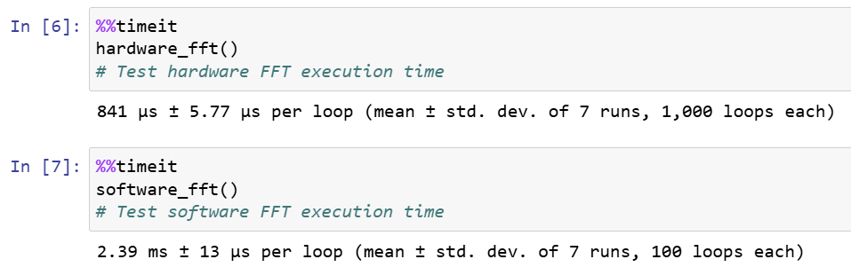

#### 8192pt

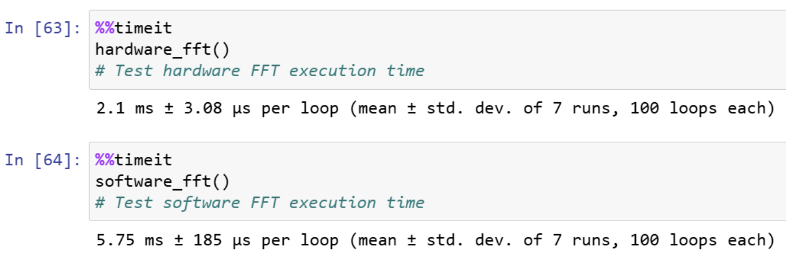

#### 16384pt

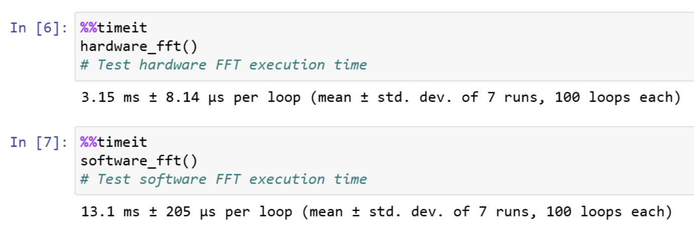

#### 65536pt

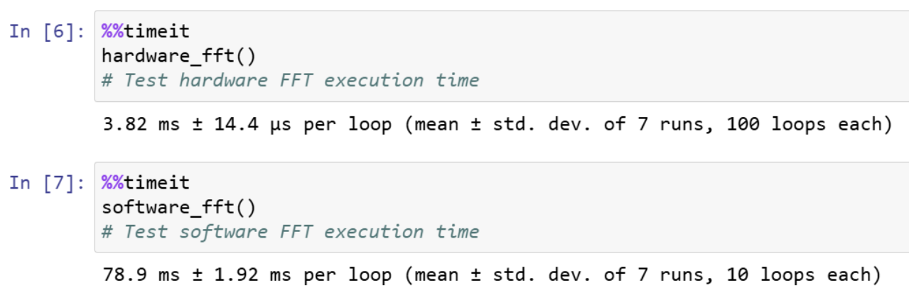

### 📊 Resource Utilization

| **Resource Name**   | **Total** | **Current Usage** | **Utilization Rate** |
| ------------------- | --------- | ----------------- | -------------------- |
| **Slice LUTs**      | 53200     | 16417             | 30.86%               |
| **Slice Registers** | 106400    | 22312             | 20.97%               |
| **DSPs**            | 220       | 54                | 24.55%               |
| **Block RAM Tile**  | 140       | 15.5              | 11.07%               |

### ⚡️ Power Consumption

| **Metric**                  | **Value** |
| --------------------------- | --------- |
| **Total On-Chip Power (W)** | **1.603** |
| Device Static (W)           | 0.144     |
| Effective TJA (C/W)         | 11.5      |
| Max Ambient (C)             | 66.5      |
| Junction Temperature (C)    | 43.5      |

## 📚 Reference

https://pynq.readthedocs.io/en/latest/

https://github.com/Xilinx/PYNQ

https://github.com/Xilinx/Vitis_Libraries

https://github.com/tmaringer/Pynq-Z2-Audio-Video-Pipelines

https://github.com/UnreaLin01/PYNQ_Z2_MUSIC_VISUALIZER/

## 📜 License
GNU General Public License v3.0

